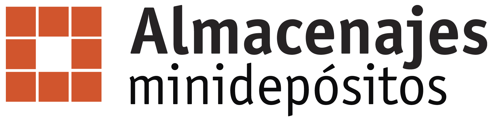

# Almacenajes Minidepósitos Landing Page 🏢


A modern, responsive website for Almacenajes Minidepósitos, a self-storage business with multiple locations across Panama. The site showcases their storage solutions, locations, features, and allows users to request quotes.



## ✨ Features

- **Modern UI/UX** - Clean, responsive design optimized for all devices
- **Interactive Elements** - Animations, sliders, and interactive maps
- **Quote Request System** - Integrated Pipedrive form for lead generation
- **Location Finder** - Interactive map showing all storage locations
- **SEO Optimized** - Structured data, meta tags, and performance optimization

## 🛠️ Tech Stack

- [Astro](https://astro.build/) - Fast, modern static site generator
- [Tailwind CSS](https://tailwindcss.com/) - Utility-first CSS framework
- [TypeScript](https://www.typescriptlang.org/) - Type-safe JavaScript
- [AOS](https://michalsnik.github.io/aos/) - Animate On Scroll library
- [Swiffy Slider](https://swiffyslider.com/) - Lightweight slider library
- [Flowbite](https://flowbite.com/) - UI component library
- [TW Elements](https://tw-elements.com/) - Tailwind Components

## 📁 Project Structure

```
/
├── public/               # Static assets (favicon, etc.)
├── src/
│   ├── assets/           # Images and other assets
│   ├── components/       # UI components
│   │   ├── Banner.astro
│   │   ├── Beneficios.astro
│   │   ├── Cotizacion.astro
│   │   ├── Footer.astro
│   │   ├── Header.astro
│   │   ├── Recomendaciones.astro
│   │   ├── Size.astro
│   │   ├── Soluciones.astro
│   │   ├── Steps.astro
│   │   └── Sucursales.astro
│   ├── css/              # CSS styles
│   ├── js/               # JavaScript utilities
│   ├── layouts/          # Layout templates
│   └── pages/            # Page components
├── .astro/               # Astro configuration
├── astro.config.mjs      # Astro configuration
└── tailwind.config.mjs   # Tailwind configuration
```

## 🚀 Getting Started

### Prerequisites

- Node.js 16.x or later
- npm or yarn

### Installation

1. Clone the repository:
```bash
git clone https://github.com/yourusername/almacenajes-minidepositos.git
cd almacenajes-minidepositos
```

2. Install dependencies:
```bash
npm install
```

3. Start the development server:
```bash
npm run dev
```

4. Open your browser and visit `http://localhost:4321`

## 📝 Available Commands

| Command                   | Action                                           |
| :------------------------ | :----------------------------------------------- |
| `npm install`             | Installs dependencies                            |
| `npm run dev`             | Starts local dev server at `localhost:4321`      |
| `npm run build`           | Build your production site to `./dist/`          |
| `npm run preview`         | Preview your build locally, before deploying     |
| `npm run astro ...`       | Run CLI commands like `astro add`, `astro check` |
| `npm run astro -- --help` | Get help using the Astro CLI                     |

## 🌐 Deployment

The site uses standard Astro build processes. After building with `npm run build`, the static files in the `dist` directory can be deployed to any static hosting service.

## 🔍 SEO Optimization

This site includes:
- Structured data for rich search results
- Meta tags for social media sharing
- Optimized images with WebP format
- XML sitemap
- `Robots.txt` configuration

## 📄 License

This project is proprietary and belongs to Almacenajes, S.A. All rights reserved.

---

Developed with ❤️ for Almacenajes Minidepósitos